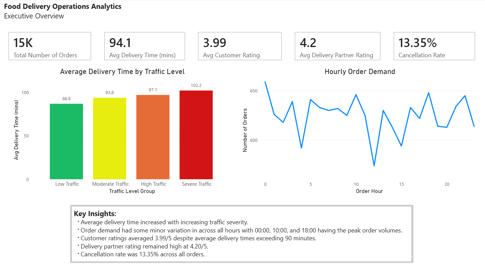
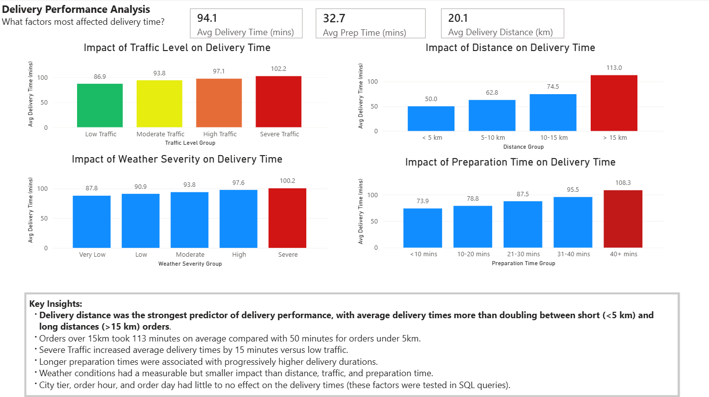
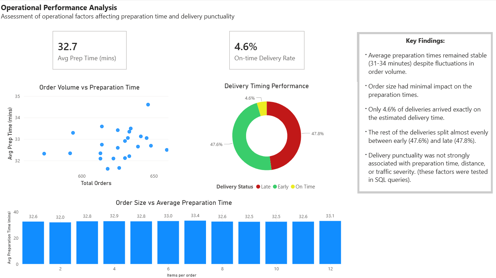
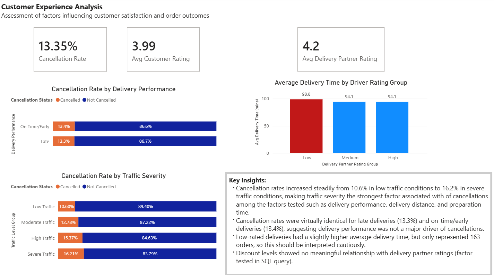
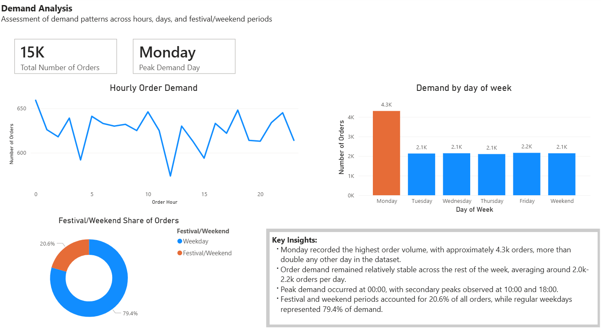

# Food Delivery Operations Analytics: Investigating delivery performance and demand patterns

## Project Overview

This project analyses food delivery operations using SQL Server and Power BI.

The objective was to identify operational factors affecting delivery performance, operational efficiency, customer satisfaction, cancellations, and demand patterns.

The project demonstrates SQL querying, KPI development, dashboard design, DAX calculations, and business insight generation.

---

## Project Objectives

- Identify the factors driving delivery delays.
- Assess restaurant and delivery partner operational performance.
- Investigate customer satisfaction and cancellation behaviour.
- Analyse demand patterns across hours, days, and festival/weekend periods.

## Tools Used

- SQL Server
- SQL
- Power BI
- DAX

---

## Project Workflow

### 1. Data Preparation

- Imported the dataset into SQL Server.
- Data cleaning
- Checked for missing values and data quality issues.
- Identified null values in:
  - Customer Rating
  - Delivery Partner Rating
  - Tip Amount

### 2. Exploratory Data Analysis

Analysed relationships between:

- Delivery time and various factors (traffic, distance, preparation time, weather severity, city tier, order hour & day)
- Preparation time and order complexity & number of orders
- Customer ratings and operational performance
- Order demand by hour and day

### 3. Dashboard Development

Created an interactive Power BI dashboard to visualise:

- Operational performance metrics
- Delivery efficiency trends
- Customer experience indicators
- Demand patterns

---

## Key Business Questions

### Delivery Performance

- What factors have the greatest impact on delivery times?

### Restaurant Operations

- Does order volume impact preparation times?
- Do larger orders require significantly longer preparation?

### Customer Experience

- Are lower customer ratings associated with slower deliveries?
- Do cancellations influence customer satisfaction?

### Demand Patterns

- When are peak ordering periods?
- Which days generate the highest demand?
  
---

## Dashboard Pages

### 1. Executive Overview
High-level summary of operational performance and key KPIs.

### 2. Delivery Performance Analysis
Investigation of traffic, weather, distance, and preparation time impacts on delivery times.

### 3. Operational Performance Analysis
Assessment of restaurant preparation performance, and delivery punctuality.

### 4. Customer Experience Analysis
Evaluation of customer ratings, driver ratings, cancellations, and customer satisfaction factors.

### 5. Demand Analysis
Analysis of hourly demand, daily demand patterns, and festival/weekend order behaviour.

---

### Executive Overview

### Delivery Performance Analysis

### Operational Performance Analysis

### Customer Experience Analysis

### Demand Analysis

---

## Key Findings

- Traffic severity was the strongest predictor of delivery delays.
- Delivery distance had a measurable impact on delivery times.
- Longer preparation times were associated with progressively higher delivery durations.
- Cancellation rates were almost identical for late and on-time deliveries.
- Traffic severity is the strongest factor associated with of cancellations among the factors tested such as delivery performance, delivery distance, and preparation time.
- Low-rated deliveries showed slightly longer average delivery times, although sample size was small.
- Monday recorded the highest order volume.
- Peak demand occurred at 00:00, with secondary peaks at 10:00 and 18:00.
- Festival and weekend periods accounted for approximately 20.6% of all orders.

---

## Conclusion & Recommendations

The analysis identified traffic conditions, delivery distance, and preparation time as the primary drivers of delivery performance.

Operational improvements should focus on:

- Optimising driver allocation during high-traffic periods.
- Improving route planning for longer-distance deliveries.
- Reducing preparation bottlenecks within restaurant operations.
- Increasing delivery capacity during peak demand periods.

Although customer ratings were expected to be heavily influenced by delivery speed, the data suggests additional factors may contribute to customer satisfaction and should be explored in future analysis.

---

## Skills Demonstrated

- SQL Aggregation
- Data Cleaning
- KPI Development
- Power BI Dashboard Design
- DAX Measures and Calculated Columns
- Business Insight Generation

---

## Dataset
- This project uses the Food Delivery Operations and Customer Analytics dataset from Kaggle.
- Source: (https://www.kaggle.com/datasets/deepeshkansotia/food-delivery-operations-and-customer-analytics?resource=download)
- (The dataset was used for educational and portfolio purposes.)
